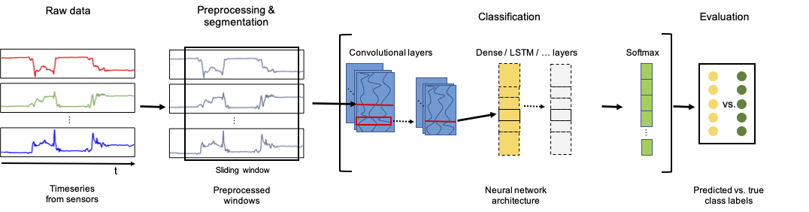

{{ page.authors }}

## Abstract

> Recent studies in Human Activity Recognition (HAR) have shown that Deep Learning methods are able to outperform classical Machine Learning algorithms. One popular Deep Learning architecture in HAR is the DeepConvLSTM. In this paper we propose to alter the DeepConvLSTM architecture to employ a 1-layered instead of a 2-layered LSTM. We validate our architecture change on 5 publicly available HAR datasets by comparing the predictive performance with and without the change employing varying hidden units within the LSTM layer(s). Results show that across all datasets, our architecture consistently improves on the original one: Recognition performance increases up to 11.7% for the F1-score, and our architecture significantly decreases the amount of learnable parameters. This improvement over DeepConvLSTM decreases training time by as much as 48%. Our results stand in contrast to the belief that one needs at least a 2-layered LSTM when dealing with sequential data. Based on our results we argue that said claim might not be applicable to sensor-based HAR.

## Resources

<a href=" {{ page.paperurl }} ">[pdf]</a> <a href=" {{ page.arxiv }} ">[arxiv]</a> <a href=" {{ page.code }} ">[github]</a> <a href=" {{ page.video }} ">[video]</a> <a href=" {{ page.poster }} ">[video]</a>

## Bibtex

    @inproceedings{bock2021improving,
	title = {Improving Deep Learning for HAR with Shallow LSTMs},
	url = {https://doi.org/10.1145/3460421.3480419},
	booktitle = {ACM International Symposium on Wearable Computers},
	author = {Bock, Marius and Hoelzemann, Alexander and Moeller, Michael and Van Laerhoven, Kristof},
	year = {2021},
}
