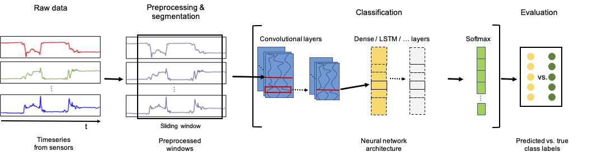

{{ page.authors }}

Full-day Tutorial held at the 2021 ACM International Symposium on Wearable Computers (ISWC'21) and International Joint Conference on Pervasive and Ubiquitous Computing (UbiComp'21).

## Abstract

> Activity recognition systems that are capable of estimating human activities from wearable inertial sensors have come a long way in the past decades. Not only have state-of-the-art methods moved away from feature engineering and have fully adopted end-to-end deep learning approaches, best practices for setting up experiments, preparing datasets, and validating activity recognition approaches have similarly evolved. This tutorial was first held at the 2021 ACM International Symposium on Wearable Computers (ISWC 21) and International Joint Conference on Pervasive and Ubiquitous Computing (UbiComp 21). The tutorial, after a short introduction in the research field of activity recognition, provides a hands-on and interactive walk-through of the most important steps in the data pipeline for the deep learning of human activities. All presentation slides shown during the tutorial, which also contain links to all code exercises, as well as the link of the GitHub page of the tutorial can be found on: https://mariusbock.github.io/dl-for-har

## Resources

<a href=" {{ page.paperurl }} ">[pdf]</a> <a href=" {{ page.arxiv }} ">[arxiv]</a> <a href=" {{ page.code }} ">[github]</a> <a href=" {{ page.video }} ">[video]</a> <a href=" {{ page.poster }} ">[video]</a>

## Bibtex

    @Article{bock2021tutorial,
    title 		= {Tutorial on Deep Learning for Human Activity Recognition},
    author 		= {Marius Bock, Alexander Hoelzemann, Michael Moeller, Kristof Van Laerhoven},
    volume      = {abs/2110.06663},
    journal     = {CoRR},
    year 		= {2021}
    }
