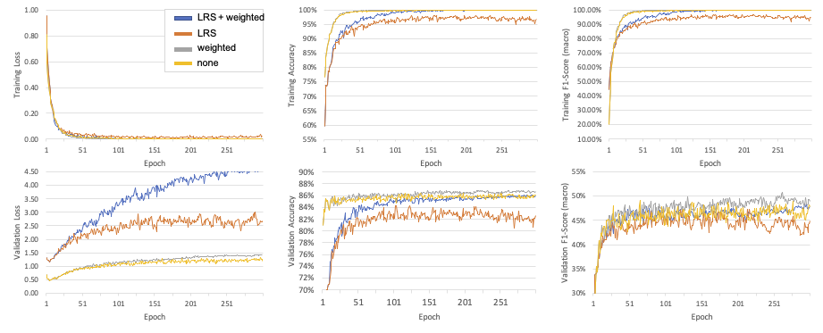

{{ page.authors }}

## Abstract

> Deep learning methods have become an almost default choice of machine learning approach for human activity recognition (HAR) systems that operate on time series data, such as those of wearable sensors. However, the implementations of such methods suffer from complex package dependencies, obsolescence, and subtleties in the implementation which are sometimes not well documented. In order to accelerate research and minimise any discrepancies between (re-)implementations, we introduce a curated, open-source repository which (1) contains complete data loading and preprocessing pipelines for 6 well-established HAR datasets, (2) supports several popular HAR deep learning architectures, and (3) provides necessary functionalities to train and evaluate said models. We welcome contributions from the fellow researcher to this repository, made available through: https://github.com/STRCSussex-UbiCompSiegen/dl_har_public

## Resources

<a href=" {{ page.paperurl }} ">[pdf]</a> <a href=" {{ page.arxiv }} ">[arxiv]</a> <a href=" {{ page.code }} ">[github]</a> <a href=" {{ page.video }} ">[video]</a> <a href=" {{ page.poster }} ">[video]</a>

## Bibtex

    @InProceedings{bock2022public,
    title 		= {A Public Repository to Improve Replicability and Collaboration in Deep Learning for HAR  },
    author 		= {Lloyd Pellatt, Marius Bock, Daniel Roggen, Kristof Van Laerhoven},
    booktitle 	= {IEEE International Conference on Pervasive Computing and Communications Workshops and other Affiliated Events (PerCom Workshops)},
    year 		= {2022}
    }
