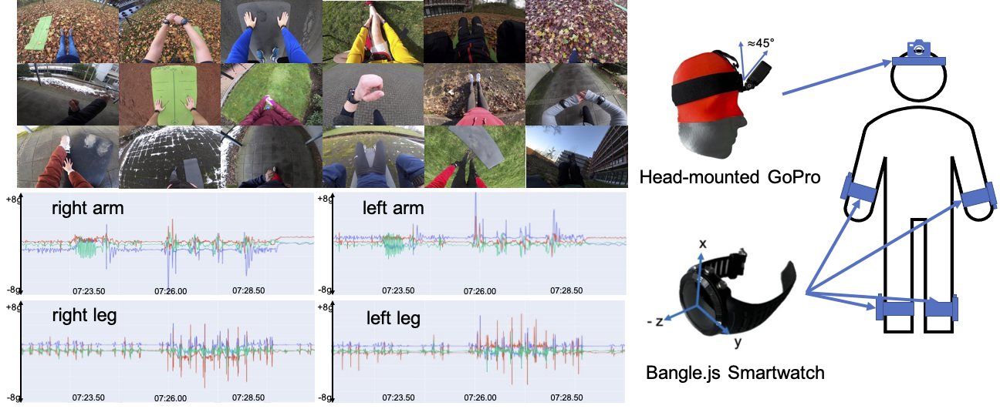

{{ page.authors }}

## Abstract

> Though research has shown the complementarity of camera- and inertial-based data, datasets which offer both modalities remain scarce. In this paper we introduce WEAR, a multimodal benchmark dataset for both vision- and wearable-based Human Activity Recognition (HAR). The dataset comprises data from 18 participants performing a total of 18 different workout activities with untrimmed inertial (acceleration) and camera (egocentric video) data recorded at 10 different outside locations. WEAR features a diverse set of activities which are low in inter-class similarity and, unlike previous egocentric datasets, not defined by human-object-interactions nor originate from inherently distinct activity categories. Provided benchmark results reveal that single-modality architectures have different strengths and weaknesses in their prediction performance. Further, in light of the recent success of transformer-based video action detection models, we demonstrate their versatility by applying them in a plain fashion using vision, inertial and combined (vision + inertial) features as input. Results show that vision transformers are not only able to produce competitive results using only inertial data, but also can function as an architecture to fuse both modalities by means of simple concatenation, with the multimodal approach being able to produce the highest average mAP, precision and close-to-best F1-scores. Up until now, vision-based transformers have neither been explored in inertial nor in multimodal human activity recognition, making our approach the first to do so. The dataset and code to reproduce experiments is publicly available via: https://mariusbock.github.io/wear/

## Resources

<a href=" {{ page.paperurl }} ">[pdf]</a> <a href=" {{ page.arxiv }} ">[arxiv]</a> <a href=" {{ page.code }} ">[github]</a> <a href=" {{ page.video }} ">[video]</a> <a href=" {{ page.poster }} ">[video]</a>

## Bibtex

    @Article{bock2023wear,
    title       = {WEAR: A Multimodal Dataset for Wearable and Egocentric Video Activity Recognition},
    author      = {Marius Bock, Michael Moeller, Kristof Van Laerhoven, Hilde Kuehne},
    volume 		= {abs/2304.05088},
    journal     = {CoRR},
    year        = {2023}
    }
