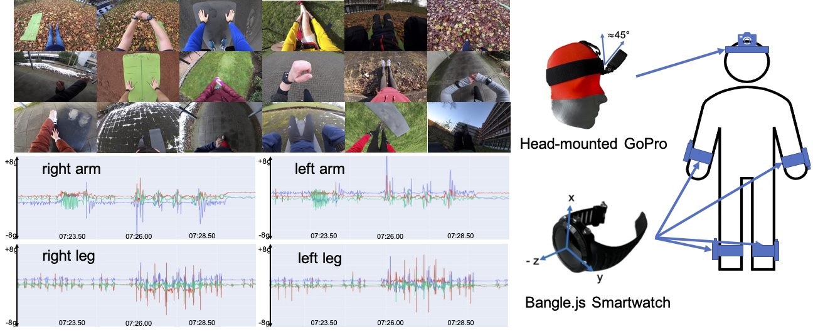

{{ page.authors }}

## Abstract

> Though research has shown the complementarity of camera- and inertial-based data, datasets which offer both modalities remain scarce. In this paper, we introduce WEAR, an outdoor sports dataset for both vision- and inertial-based human activity recognition (HAR). The dataset comprises data from 18 participants performing a total of 18 different workout activities with untrimmed inertial (acceleration) and camera (egocentric video) data recorded at 10 different outside locations. Unlike previous egocentric datasets, WEAR provides a challenging prediction scenario marked by purposely introduced activity variations as well as an overall small information overlap across modalities. Provided benchmark results reveal that single-modality architectures each have different strengths and weaknesses in their prediction performance. Further, in light of the recent success of transformer-based temporal action localization models, we demonstrate their versatility by applying them in a plain fashion using vision, inertial and combined (vision + inertial) features as input. Results demonstrate both the applicability of vision-based transformers for inertial data and fusing both modalities by means of simple concatenation, with the combined approach (vision + inertial features) being able to produce the highest mean average precision and close-to-best F1-score. The dataset and code to reproduce experiments is publicly available via: https://mariusbock.github.io/wear/

## Resources

<a href=" {{ page.paperurl }} ">[pdf]</a> <a href=" {{ page.arxiv }} ">[arxiv]</a> <a href=" {{ page.code }} ">[github]</a> <a href=" {{ page.video }} ">[video]</a> <a href=" {{ page.poster }} ">[video]</a>

## Bibtex

    @Article{bock2023wear,
    title       = {WEAR: An Outdoor Sports Dataset for Wearable and Egocentric Activity Recognition},
    author      = {Marius Bock, Hilde Kuehne, Kristof Van Laerhoven, Michael Moeller},
    volume 		= {abs/2304.05088},
    journal     = {CoRR},
    year        = {2023}
    }
