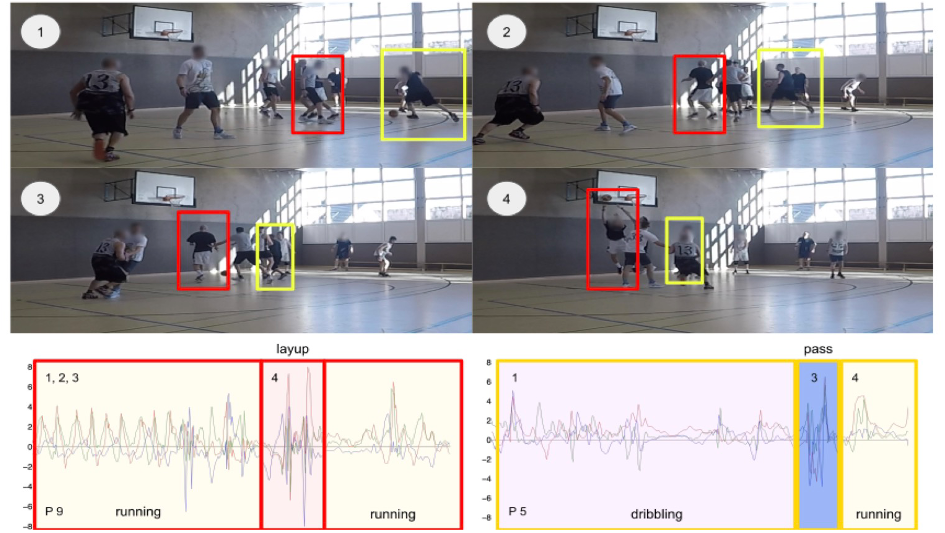

{{ page.authors }}

## Abstract

> We present a benchmark dataset for evaluating physical human activity recognition methods from wrist-worn sensors, for the specific setting of basketball training, drills, and games. Basketball activities lend themselves well for measurement by wrist-worn inertial sensors, and systems that are able to detect such sport-relevant activities could be used in applications toward game analysis, guided training, and personal physical activity tracking. The dataset was recorded for two teams from separate countries (USA and Germany) with a total of 24 players who wore an inertial sensor on their wrist, during both repetitive basketball training sessions and full games. Particular features of this dataset include an inherent variance through cultural differences in game rules and styles as the data was recorded in two countries, as well as different sport skill levels, since the participants were heterogeneous in terms of prior basketball experience. We illustrate the dataset's features in several time-series analyses and report on a baseline classification performance study with two state-of-the-art deep learning architectures.

## Resources

<a href=" {{ page.paperurl }} ">[pdf]</a> <a href=" {{ page.arxiv }} ">[arxiv]</a> <a href=" {{ page.code }} ">[github]</a> <a href=" {{ page.video }} ">[video]</a> <a href=" {{ page.poster }} ">[video]</a>

## Bibtex

    
@article{hoelzemann2023hangtime,
	title = {Hang-time HAR: A benchmark dataset for basketball activity recognition using wrist-worn inertial sensors},
	volume = {23},
	url = {https://doi.org/10.3390/s23135879},
	number = {13},
	journal = {Sensors},
	author = {Hoelzemann, Alexander and Romero, Julia L. and Bock, Marius and Van Laerhoven, Kristof and Lv, Qin},
	year = {2023},
}

