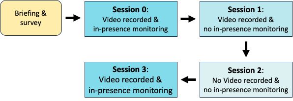

{{ page.authors }}

## Abstract

> Known as the Hawthorne Effect, studies have shown that participants alter their behavior and execution of activities in response to being observed. With researchers from a multitude of human- centered studies knowing of the existence of the said effect, quantitative studies investigating the neutrality and quality of data gathered in monitored versus unmonitored setups, particularly in the context of Human Activity Recognition (HAR), remain largely underexplored. With the development of tracking devices providing the possibility of carrying out less invasive observation of participants’ conduct, this study provides a data-driven approach to measure the effects of observation on participants’ execution of five workout-based activities. Using both classical feature analysis and deep learning-based methods we analyze the accelerometer data of 10 participants, showing that a different degree of observation only marginally influences captured patterns and predictive performance of classification algorithms. Although our findings do not dismiss the existence of the Hawthorne Effect, it does challenge the prevailing notion of the applicability of laboratory compared to in-the-wild recorded data. The dataset and code to reproduce our experiments are available via https://github.com/mariusbock/hawthorne_har.

## Resources

<a href=" {{ page.paperurl }} ">[pdf]</a> <a href=" {{ page.arxiv }} ">[arxiv]</a> <a href=" {{ page.code }} ">[github]</a> <a href=" {{ page.video }} ">[video]</a> <a href=" {{ page.poster }} ">[video]</a>

## Bibtex

    @inproceedings{hoelzemann2023hawthorne,
    author = {Hoelzemann, Alexander and Bock, Marius and Valladares Bastias, Ericka Andrea and El Ouazzani Touhami, Salma and Nassiri, Kenza and Van Laerhoven, Kristof},
    title = {A Data-Driven Study on the Hawthorne Effect in Sensor-Based Human Activity Recognition},
    year = {2023},
    url = {https://doi.org/10.1145/3594739.3610743},
    booktitle = {Adjunct Proceedings of the ACM International Joint Conference on Pervasive and Ubiquitous Computing & the ACM International Symposium on Wearable Computing},
}
