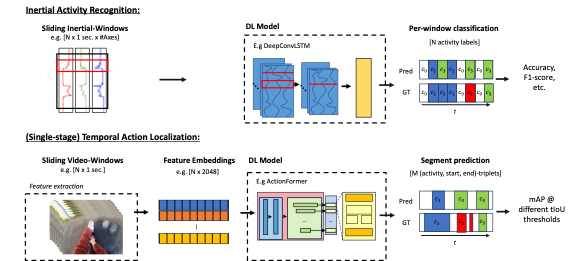

{{ page.authors }}

## Abstract

> A persistent trend in Deep Learning has been the applicability of machine learning concepts to other areas than originally introduced for. As of today, state-of-the-art activity recognition from wearable sensors relies on classifiers being trained on fixed windows of data. Contrarily, video-based Human Activity Recognition has followed a segment-based prediction approach, localizing activity occurrences from start to end. This paper is the first to systematically demonstrate the applicability of state-of-the-art TAL models for wearable Human Activity Recongition (HAR) using raw inertial data as input. Our results show that state-of-the-art TAL models are able to outperform popular inertial models on 4 out of 6 wearable activity recognition benchmark datasets, with improvements ranging as much as 25% in F1-score. Introducing the TAL community's most popular metric to inertial-based HAR, namely mean Average Precision, our analysis shows that TAL models are able to produce more coherent segments along with an overall higher NULL-class accuracy across all datasets. Being the first to provide such an analysis, the TAL community offers an interesting new perspective to inertial-based HAR with yet to be explored design choices and training concepts, which could be of significant value for the inertial-based HAR community.

## Resources

<a href=" {{ page.paperurl }} ">[pdf]</a> <a href=" {{ page.arxiv }} ">[arxiv]</a> <a href=" {{ page.code }} ">[github]</a> <a href=" {{ page.video }} ">[video]</a> <a href=" {{ page.poster }} ">[video]</a>

## Bibtex

    @article{bock2023talforhar,
    title={Temporal Action Localization for Inertial-based Human Activity Recognition},
    author={Bock, Marius and Moeller, Michael and Van Laerhoven, Kristof},
    volume={abs/2311.15831},
    journal={CoRR},
    year={2023},
    url={https://arxiv.org/abs/2311.15831}
}
