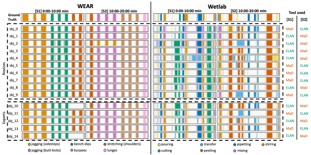

{{ page.authors }}

## Abstract

> Despite the simplicity of labels and extensive study protocols provided during data collection, the majority of researchers in sensor-based technologies tend to rely on annotations provided by a combination of field experts and researchers themselves. This paper presents a comprehensive study on the quality of annotations provided by expert versus novice annotators for inertial-based activity benchmark datasets. We consider multiple parameters such as the nature of the activities to be labeled, and the annotation tool, to quantify the annotation quality and time needed. 15 participants were tasked to annotate a total of 40 minutes of data from two publicly available benchmark datasets for inertial activity recognition, being simultaneously displayed both video and accelerometer data during annotation. We compare the resulting labels with the ground truth provided by the original dataset authors. Our participants annotated the data using two representative tools. Metrics like F1-Score and Cohen’s Kappa showed experience did not ensure better labels. While experts were more accurate on the complex Wetlab dataset (51% vs 46%), Novices had 96% F1 on the simple WEAR dataset versus 92% for experts. Comparable Kappa scores (0.96 and 0.94 for WEAR, 0.53 and 0.59 for Wetlab) indicated similar quality for both groups, revealing differences in dataset complexity. Furthermore, experts annotated faster regardless of the tool. Given proven success across research, our findings suggest crowdsourcing wearable dataset annotation to non-experts warrants exploration as a valuable yet underinvestigated approach, up to a complexity level beyond which quality may suffer.

## Resources

<a href=" {{ page.paperurl }} ">[pdf]</a> <a href=" {{ page.arxiv }} ">[arxiv]</a> <a href=" {{ page.code }} ">[github]</a> <a href=" {{ page.video }} ">[video]</a> <a href=" {{ page.poster }} ">[video]</a>

## Bibtex

    @inproceedings{hoelzemannbock2024videoannotation,
  	title = {Evaluation of Video-Assisted Annotation of Human IMU Data Across Expertise, Datasets, and Tools},
  	author = {Alexander Hoelzemann and Marius Bock and Kristof Van Laerhoven},
  	booktitle = {2024 IEEE International Conference on Pervasive Computing and Communications Workshops and other Affiliated Events (PerCom Workshops)},
  	year = {2024},
  	url = {https://doi.org/10.1109/PerComWorkshops59983.2024.10503292},
  	publisher = {IEEE Computer Society},
}
