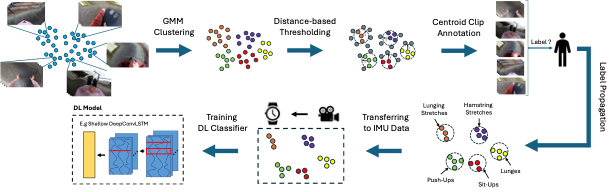

{{ page.authors }}

## Abstract

> As wearable-based data annotation remains, to date, a tedious, time-consuming task requiring researchers to dedicate substantial time, benchmark datasets within the field of Human Activity Recognition in lack richness and size compared to datasets available within related fields. Recently, vision foundation models such as CLIP have gained significant attention, helping the vision community advance in finding robust, generalizable feature representations. With the majority of researchers within the wearable community relying on vision modalities to overcome the limited expressiveness of wearable data and accurately label their to-be-released benchmark datasets offline, we propose a novel, clustering-based annotation pipeline to significantly reduce the amount of data that needs to be annotated by a human annotator. We show that using our approach, the annotation of centroid clips suffices to achieve average labelling accuracies close to 90% across three publicly available HAR benchmark datasets. Using the weakly annotated datasets, we further demonstrate that we can match the accuracy scores of fully-supervised deep learning classifiers across all three benchmark datasets. Code as well as supplementary figures and results are publicly downloadable via https://github.com/mariusbock/weak_har.

## Resources

<a href=" {{ page.paperurl }} ">[pdf]</a> <a href=" {{ page.arxiv }} ">[arxiv]</a> <a href=" {{ page.code }} ">[github]</a> <a href=" {{ page.video }} ">[video]</a> <a href=" {{ page.poster }} ">[video]</a>

## Bibtex

    @article{bock2024annotation,
  	title = {Weak-Annotation of HAR Datasets using Vision Foundation Models},
  	author = {Bock, Marius and Van Laerhoven, Kristof and Moeller, Michael},
  	publisher = {Association for Computing Machinery},
  	booktitle = {Proceedings of the 2024 ACM International Symposium on Wearable Computers},
  	pages = {55–62},
  	year={2024},
  	url = {https://doi.org/10.1145/3675095.3676613},
}
