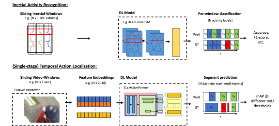

{{ page.authors }}

## Abstract

> As of today, state-of-the-art activity recognition from wearable sensors relies on algorithms being trained to classify fixed windows of data. In contrast, video-based Human Activity Recognition, known as Temporal Action Localization (TAL), has followed a segment-based prediction approach, localizing activity segments in a timeline of arbitrary length. This paper is the first to systematically demonstrate the applicability of state-of-the-art TAL models for both offline and near-online Human Activity Recognition (HAR) using raw inertial data as well as pre-extracted latent features as input. Offline prediction results show that TAL models are able to outperform popular inertial models on a multitude of HAR benchmark datasets, with improvements reaching as much as 26% in F1-score. We show that by analyzing timelines as a whole, TAL models can produce more coherent segments and achieve higher NULL-class accuracy across all datasets. We demonstrate that TAL is less suited for the immediate classification of small-sized windows of data, yet offers an interesting perspective on inertial-based HAR -- alleviating the need for fixed-size windows and enabling algorithms to recognize activities of arbitrary length. With design choices and training concepts yet to be explored, we argue that TAL architectures could be of significant value to the inertial-based HAR community.The code and data download to reproduce experiments is publicly available via https://github.com/mariusbock/tal_for_har.

## Resources

<a href=" {{ page.paperurl }} ">[pdf]</a> <a href=" {{ page.arxiv }} ">[arxiv]</a> <a href=" {{ page.code }} ">[github]</a> <a href=" {{ page.video }} ">[video]</a> <a href=" {{ page.poster }} ">[video]</a>

## Bibtex

    @article{bock2024talforhar,
    author={Bock, Marius and Moeller, Michael and Van Laerhoven, Kristof},
    title={Temporal Action Localization for Inertial-based Human Activity Recognition},
    year = {2024},
    volume = {8},
    number = {4},
    journal = {Proc. ACM Interact. Mob. Wearable Ubiquitous Technol. (IMWUT)},
    numpages = {19},
    articleno = {174},
    doi = {10.1145/3699770},
    url={https://dl.acm.org/doi/10.1145/3699770}
}
