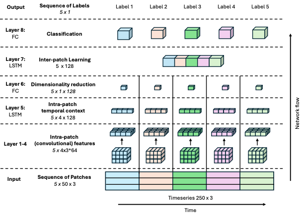

{{ page.authors }}

## Abstract

> Despite recognized limitations in modeling long-range temporal dependencies, Human Activity Recognition (HAR) has traditionally relied on a sliding window approach to segment labeled datasets. Deep learning models like the DeepConvLSTM typically classify each window independently, thereby restricting learnable temporal context to within-window information. To address this constraint, we propose DeepConvContext, a multi-scale time series classification framework for HAR. Drawing inspiration from the vision-based Temporal Action Localization community, DeepConvContext models both intra- and inter-window temporal patterns by processing sequences of time-ordered windows. Unlike recent HAR models that incorporate attention mechanisms, DeepConvContext relies solely on LSTMs -- with ablation studies demonstrating the superior performance of LSTMs over attention-based variants for modeling inertial sensor data. Across six widely-used HAR benchmarks, DeepConvContext achieves an average 10% improvement in F1-score over the classic DeepConvLSTM, with gains of up to 21%. Code to reproduce our experiments is publicly available via http://github.com/mariusbock/context_har.

## Resources

<a href=" {{ page.paperurl }} ">[pdf]</a> <a href=" {{ page.arxiv }} ">[arxiv]</a> <a href=" {{ page.code }} ">[github]</a> <a href=" {{ page.video }} ">[video]</a> <a href=" {{ page.poster }} ">[video]</a>

## Bibtex

    @article{bock2025deepcovncontext,
    author={Bock, Marius and Moeller, Michael and Van Laerhoven, Kristof},
    title = {DeepConvContext: A Multi-Scale Approach to Timeseries Classification in Human Activity Recognition},
    year = {2025},
    volume = {abs/2505.20894},
    journal = {CoRR},
    doi = {10.48550/arXiv.2505.20894},
    url={https://doi.org/10.48550/arXiv.2505.20894}
}
