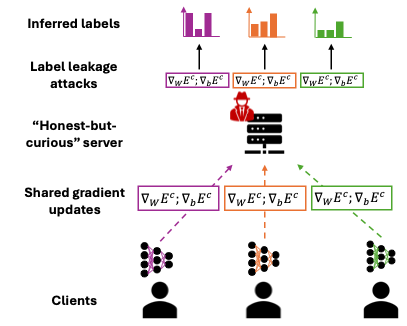

{{ page.authors }}

## Abstract

> While prior work has shown that Federated Learning updates can leak sensitive information, label reconstruction attacks, which aim to recover input labels from shared gradients, have not yet been examined in the context of Human Activity Recognition (HAR). Given the sensitive nature of activity labels, this study evaluates the effectiveness of state-of-the-art gradient-based label leakage attacks on HAR benchmark datasets. Our findings show that the number of activity classes, sampling strategy, and class imbalance are critical factors influencing the extent of label leakage, with reconstruction accuracies reaching up to 90% on two benchmark datasets, even for trained models. Moreover, we find that Local Differential Privacy techniques such as gradient noise and clipping offer only limited protection, as certain attacks still reliably infer both majority and minority class labels. We conclude by offering practical recommendations for the privacy-aware deployment of federated HAR systems and identify open challenges for future research. Code to reproduce our experiments is publicly available via http://github.com/mariusbock/leakage_har

## Resources

<a href=" {{ page.paperurl }} ">[pdf]</a> <a href=" {{ page.arxiv }} ">[arxiv]</a> <a href=" {{ page.code }} ">[github]</a> <a href=" {{ page.video }} ">[video]</a> <a href=" {{ page.poster }} ">[video]</a>

## Bibtex

    @article{bock2025leakage,
    author={Bock, Marius and Van Laerhoven, Kristof and Moeller, Michael},
    title = {Label Leakage in Federated Inertial-based Human Activity Recognition},
    year = {2025},
    volume = {abs/2505.20924},
    journal = {CoRR},
    doi = {10.48550/arXiv.2505.20924},
    url={https://doi.org/10.48550/arXiv.2505.20924}
}
